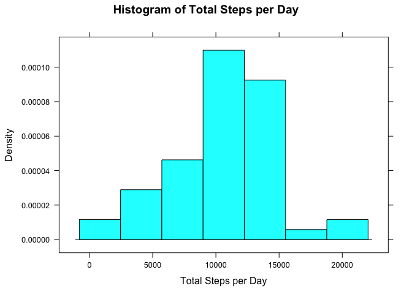
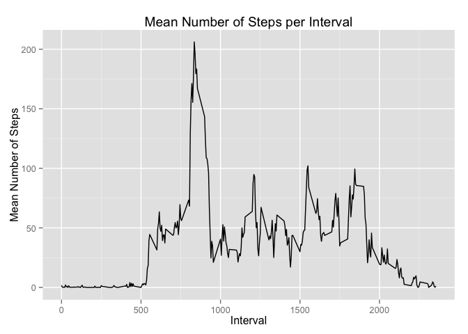
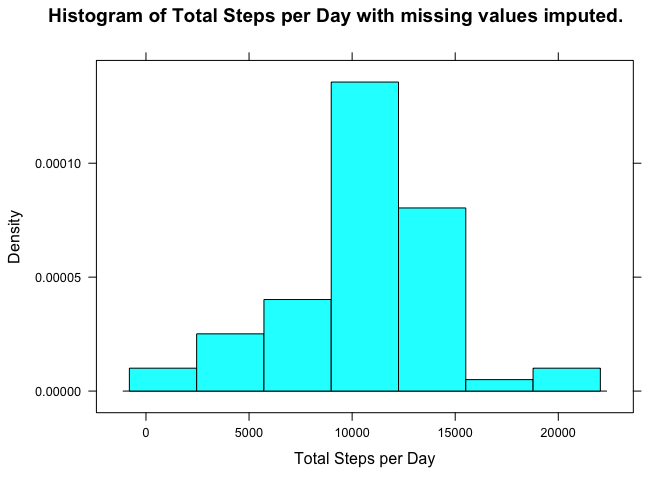

# Reproducible Research: Peer Assessment 1


## Loading and preprocessing the data


```r
setwd("~/study/reproducible_research/RepData_PeerAssessment1")
activity <- read.csv("activity.csv")
activity$date <- as.Date(activity$date)
str(activity)
```

```
## 'data.frame':	17568 obs. of  3 variables:
##  $ steps   : int  NA NA NA NA NA NA NA NA NA NA ...
##  $ date    : Date, format: "2012-10-01" "2012-10-01" ...
##  $ interval: int  0 5 10 15 20 25 30 35 40 45 ...
```

```r
head(activity)
```

```
##   steps       date interval
## 1    NA 2012-10-01        0
## 2    NA 2012-10-01        5
## 3    NA 2012-10-01       10
## 4    NA 2012-10-01       15
## 5    NA 2012-10-01       20
## 6    NA 2012-10-01       25
```

## What is mean total number of steps taken per day?


```r
library(plyr)
library(dplyr)
```

Calculate the total number of steps taken per day.


```r
totalActivityByDate <- ddply(activity, .(date), summarize, steps=sum(steps))
```

Here is a histogram of the total number of steps taken each day.


```r
library(lattice)
histogram(~steps, data=totalActivityByDate, type="density",
          xlab="Total Steps per Day", main="Histogram of Total Steps per Day")
```

 

Now we calculate the mean and median total number of steps per day.


```r
mean_total_steps <- mean(totalActivityByDate$steps, na.rm = TRUE)
mean_total_steps
```

```
## [1] 10766.19
```

```r
median_total_steps <- median(totalActivityByDate$steps, na.rm = TRUE)
median_total_steps
```

```
## [1] 10765
```

The mean total number of steps taken per day is 10766.19. The median total number of steps taken per day is 10765.

## What is the average daily activity pattern?

Here we calculate the average number of steps per 5-minute interval, averaged across all days, and plot it as a time series.


```r
meanActivityByInterval <- ddply(activity, .(interval), summarize, steps=mean(steps, na.rm = TRUE))

library(ggplot2)
qplot(interval, steps, data = meanActivityByInterval, geom = "line", 
      main = "Mean Number of Steps per Interval", 
      xlab = "Interval", ylab = "Mean Number of Steps")
```

 

Which 5-minute interval, on average across all days in the dataset, contains the maximum number of steps?


```r
maxSteps <- meanActivityByInterval[which.max(meanActivityByInterval$steps), ]
maxSteps
```

```
##     interval    steps
## 104      835 206.1698
```

The 5-minute interval with the maximum average number of steps has the value 835 with an average of 206.1698 steps.

This intervals correpsonds to the time 13:55.

## Imputing missing values


```r
numberOfMissingValues <- sum(is.na(activity$steps))
numberOfMissingValues
```

```
## [1] 2304
```

The data set includes 2304 rows where the value of steps is missing.

We will create a new dataset where those missing values are replaced with the corresponding mean number of steps for that interval.


```r
lookupMeanSteps <- function(interval) {
    return(meanActivityByInterval[match(interval, meanActivityByInterval$interval), ]$steps)
}

imputeSteps <- function(originalSteps, interval) {
    ifelse(is.na(originalSteps), lookupMeanSteps(interval), originalSteps)
}

newActivity <- activity
newActivity$steps <- imputeSteps(newActivity$steps, newActivity$interval)
```

Here we verify the imputation worked as desired for the first few observations.


```r
head(activity)
```

```
##   steps       date interval
## 1    NA 2012-10-01        0
## 2    NA 2012-10-01        5
## 3    NA 2012-10-01       10
## 4    NA 2012-10-01       15
## 5    NA 2012-10-01       20
## 6    NA 2012-10-01       25
```

```r
head(meanActivityByInterval)
```

```
##   interval     steps
## 1        0 1.7169811
## 2        5 0.3396226
## 3       10 0.1320755
## 4       15 0.1509434
## 5       20 0.0754717
## 6       25 2.0943396
```

```r
head(newActivity)
```

```
##       steps       date interval
## 1 1.7169811 2012-10-01        0
## 2 0.3396226 2012-10-01        5
## 3 0.1320755 2012-10-01       10
## 4 0.1509434 2012-10-01       15
## 5 0.0754717 2012-10-01       20
## 6 2.0943396 2012-10-01       25
```

Now we calculate the total number of steps taken per day for the new dataset.


```r
newTotalActivityByDate <- ddply(newActivity, .(date), summarize, steps=sum(steps))
```

Here is a histogram of the number of steps taken each day for the new dataset with missing values imputed.


```r
library(lattice)
histogram(~steps, data=newTotalActivityByDate, type = "density",
          xlab = "Total Steps per Day", main = "Histogram of Total Steps per Day with missing values imputed.")
```

 


```r
new_mean_total_steps <- mean(newTotalActivityByDate$steps, na.rm = FALSE)
new_mean_total_steps
```

```
## [1] 10766.19
```

```r
new_median_total_steps <- median(newTotalActivityByDate$steps, na.rm = FALSE)
new_median_total_steps
```

```
## [1] 10766.19
```

The mean total number of steps taken per day is 10766.19. The median total number of steps taken per day is 10766.19. These values are almost exactly the same as the ones calculated from the original data.

Imputing missing data has almost no impact on estimates of the total daily number of steps.

## Are there differences in activity patterns between weekdays and weekends?

Now we will create a factor variable `dayFactor` with two levels, "weekday" and "weekend" indicating whether the date is a weekday or weekend day.


```r
newActivity$dayFactor <- factor(weekdays(newActivity$date) %in% c("Saturday", "Sunday"), levels = c(FALSE, TRUE), labels = c("weekday", "weekend"))

head(newActivity)
```

```
##       steps       date interval dayFactor
## 1 1.7169811 2012-10-01        0   weekday
## 2 0.3396226 2012-10-01        5   weekday
## 3 0.1320755 2012-10-01       10   weekday
## 4 0.1509434 2012-10-01       15   weekday
## 5 0.0754717 2012-10-01       20   weekday
## 6 2.0943396 2012-10-01       25   weekday
```

Finally, we calculate and plot the average number of steps per 5-minute interval averaged across all weekdays and averaged across all weekend days.


```r
newMeanActivityByInterval <- ddply(newActivity, .(interval, dayFactor), summarize, steps=mean(steps))

aggregate(newMeanActivityByInterval$steps, by = list(newMeanActivityByInterval$dayFactor), FUN = summary)
```

```
##   Group.1  x.Min. x.1st Qu. x.Median  x.Mean x.3rd Qu.  x.Max.
## 1 weekday   0.000     2.247   25.800  35.610    50.850 230.400
## 2 weekend   0.000     1.241   32.340  42.370    74.650 166.600
```

```r
xyplot(steps ~ interval | dayFactor, data = newMeanActivityByInterval, type = 'l', 
       xlab = "Interval", ylab = "Number of Steps", layout = c(1, 2))
```

 

It appears that people represented in this dataset on average took more steps on weekends than on weekdays. The pattern of step activity througout the day was also different, with higher step activity being spread through more of the day on weekends compared to weekdays.
